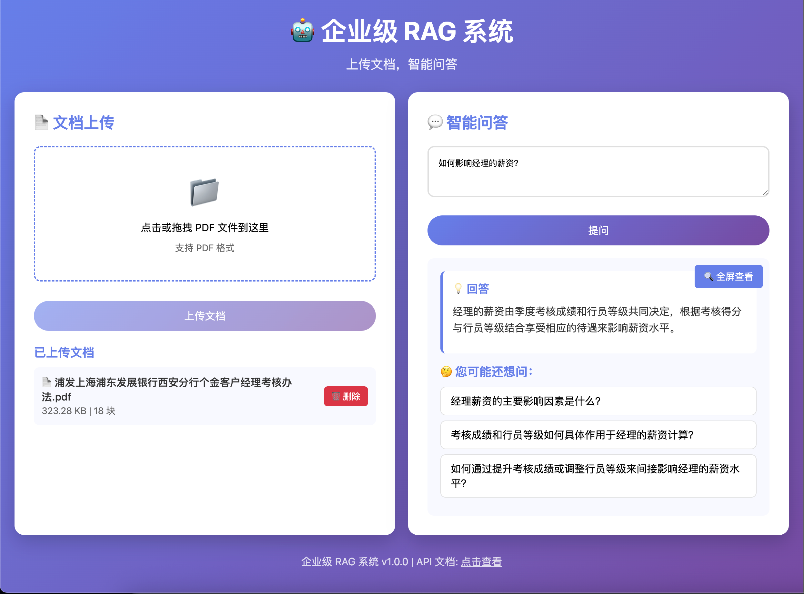

# 企业级 RAG 系统

基于 PDF 文档的智能问答系统，支持文档导入、向量检索和智能问答。

## 📸 系统界面



*Web 界面展示：文档上传、智能问答等功能*

## 功能特性

- 📄 **PDF 文档处理**：支持上传和解析 PDF 文档
- 🔍 **智能检索**：基于向量相似度的文档检索
- 🤖 **智能问答**：基于文档内容的问答系统
- 💡 **问题推荐**：自动生成相关问题建议
- 🔄 **降级方案**：Qdrant 主选，FAISS 降级
- 🇨🇳 **国内可用**：使用国内可访问的模型和服务
- ✂️ **智能切片**：支持可配置的文本分块策略

## 技术栈

- **API 框架**：FastAPI
- **向量数据库**：Qdrant（主选）/ FAISS（降级）
- **Embedding 模型**：m3e-large（本地部署）
- **LLM 模型**：DeepSeek-R1（本地部署）
- **文档处理**：PyPDF2 / langchain

## 快速开始

### 1. 安装依赖

```bash
# 创建虚拟环境
python -m venv venv

# 激活虚拟环境
# macOS/Linux:
source venv/bin/activate
# Windows:
# venv\Scripts\activate

# 安装依赖
pip install -r requirements.txt
```

### 2. 配置环境变量

```bash
cp .env.example .env
# 编辑 .env 文件，配置必要的参数
```

#### 切片策略配置

在 `.env` 文件中可以配置文本切片参数：

```bash
# 文本分块大小（字符数），默认 1000
CHUNK_SIZE=1000

# 文本分块重叠大小（字符数），默认 200
CHUNK_OVERLAP=200
```

**切片策略说明**：
- **chunk_size**：每个文本块的目标大小（字符数）
- **chunk_overlap**：相邻文本块之间的重叠大小，用于保持上下文连续性
- **智能分割**：系统会优先在以下位置进行分割：
  - 段落分隔符（`\n\n`）
  - 换行符（`\n`）
  - 中文标点：`。`、`！`、`？`
  - 英文标点：`.`、`!`、`?`

**推荐配置**：
- 小文档（<10页）：`CHUNK_SIZE=500, CHUNK_OVERLAP=100`
- 中等文档（10-50页）：`CHUNK_SIZE=1000, CHUNK_OVERLAP=200`（默认）
- 大文档（>50页）：`CHUNK_SIZE=1500, CHUNK_OVERLAP=300`

### 3. 初始化数据库

```bash
python scripts/init_db.py
```

### 4. 启动服务

```bash
uvicorn src.api.main:app --host 0.0.0.0 --port 8000 --reload
```

### 5. 访问 API 文档

打开浏览器访问：http://localhost:8000/docs

## API 接口

### 文档管理

- `POST /api/v1/documents/upload` - 上传文档
- `GET /api/v1/documents` - 获取文档列表
- `DELETE /api/v1/documents/{doc_id}` - 删除文档

### 查询接口

- `POST /api/v1/query` - 提问查询

### 健康检查

- `GET /api/v1/health` - 健康检查

## 项目结构

```
china-pdf-rag/
├── docs/                # 📚 项目文档
├── config/              # 配置文件
├── src/
│   ├── api/            # API 接口
│   ├── core/           # 核心模块
│   ├── processors/     # 文档处理器
│   ├── services/       # 业务服务
│   └── utils/          # 工具函数
├── data/               # 数据存储
├── tests/              # 测试文件
└── scripts/            # 脚本文件
```

## 📚 文档

- [快速开始指南](docs/QUICKSTART.md) - 5分钟快速上手
- [项目结构说明](docs/PROJECT_STRUCTURE.md) - 详细的架构和模块说明
- [开发计划清单](docs/checklist.md) - 完整的开发任务和进度
- [启动服务指南](docs/START_SERVER.md) - 详细的启动步骤
- [快速修复指南](docs/QUICK_FIX.md) - 常见问题解决
- [项目完成报告](docs/PROJECT_COMPLETED.md) - 完整项目总结
- [**文本切片策略**](docs/CHUNKING_STRATEGY.md) - 详细的文本分块策略说明
- [架构优化方案](docs/ARCHITECTURE_OPTIMIZATION.md) - 高并发与分布式优化
- [GraphRAG升级方案](docs/GRAPH_RAG_UPGRADE.md) - 知识图谱增强方案

## 环境要求

- Python 3.8+
- 8GB+ RAM（用于模型加载）
- （可选）CUDA GPU（加速推理）

## 开发指南

### 运行测试

```bash
pytest tests/
```

### 代码格式化

```bash
black src/
flake8 src/
```

## 许可证

MIT License

## 贡献

欢迎提交 Issue 和 Pull Request！

